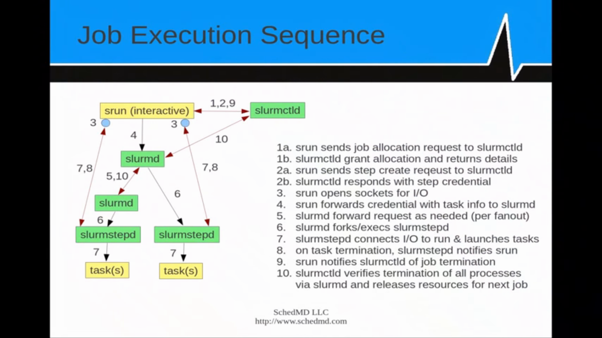

# Introduction to Slurm Tutorial
[Tutorial Link](https://slurm.schedmd.com/tutorials.html)
This is a series of youtube tutorial on Slurm which is used to schedule job on high performance computer. I need to know a bit more about Slurm to schedule my jobs across node properly on CalculQuebec cluster.

## Part 1:
[Part 1 Tutorial Link](https://www.youtube.com/watch?v=NH_Fb7X6Db0&feature=relmfu)
- Slurm is the glue for parallel computer, make it like a personal pc
- Ressource manager launch and manage jobs
- The jobs scheduler come into the picture when we have more work than ressources
- Stand for Simple Linux Utility for Ressource Management
- Has lots of plugins (70)
- Is open source
- Written in C without kernel modification
- It follows a building block approach

## Part 2
[Part 2 Tutorial link](https://www.youtube.com/watch?v=LJrY0AthLB8&feature=relmfu)
- Slurmdbd is the daemon for the database + accounting (one per entreprise)
- Slurmctld is the daemon to control the cluster (one per cluster)
- Slurmnd is the daemon for managing a task (one per node).
- Each daemonhas commond ops:
    - `-c` clear previous state
    - `-D` run in foreground
    - `-v` verbosity, more v in a command means more information outputed
    - `-C` will give the current node configuration
- Slurmstepd manage job step (not really a daemon) manage a job step
- man page + `--help` option available for most commands
- commands can be run on anyn node
- The format for time in slurm is `days-hours:minutes:seconds` this is especially important for wall-time

## Part 3
[Part 3 Tutorial link](https://www.youtube.com/watch?v=MI9jHavOt5o&feature=relmfu)
- main commands available are only like 4
- sbatch is a submission for later execution (will get a jobid back)
- salloc create job allocation & start shell to use it interactively
- srun create job allocation launch job step
- sattach in/out/err for existing jobs
- can use the `--depend` flag to launch a job  only when another job finish
- job execution sequence is quite complicated lots of daemon are spawned (see below).

## Part 4
[Part 4 Tutorial link](https://www.youtube.com/watch?v=aljhVYwyAoM)
- There are more Slurm commands we can use to gain insight about jobs and step
- sinfo show the states of nodes/ queues, lots of filtering capabilities
- squeue report job et job step states
- smap report system job or step states with topology
- sview report/update system job step (there is some 3D visual going on there with cray)
- scontrol is for admin to update the system, job, step etc.
- if you use the flag `-i60` will report states every 60 seconds
- the flag -u in squeue will filter for user
- There are also accounting commands
- sacct report info by individual job et job step
- sstat report currently running job
- sreport consolidated report by user, cluster etc.
We also have a bunch of other accounting/management commands.

## Part 5
[Part 5 Tutorial link](https://www.youtube.com/watch?v=-4XFG5MoHQY)
- Support for accounting in database is very flexible
- We have other useful commands:
- scancel which is used to cancel jobs et job step
- sbcast which is used to transfer file to a compute nodes allocated to a job
- strigger is a event trigger management tool
- we can run script when job is close to time limit, this is how the Beluga cluster is sending emails
- Slurm is on github if we want the latest version, but its nothing I plan on doing anytime soon.

Rest is not useful for me since its about system admin stuff to build slurm.